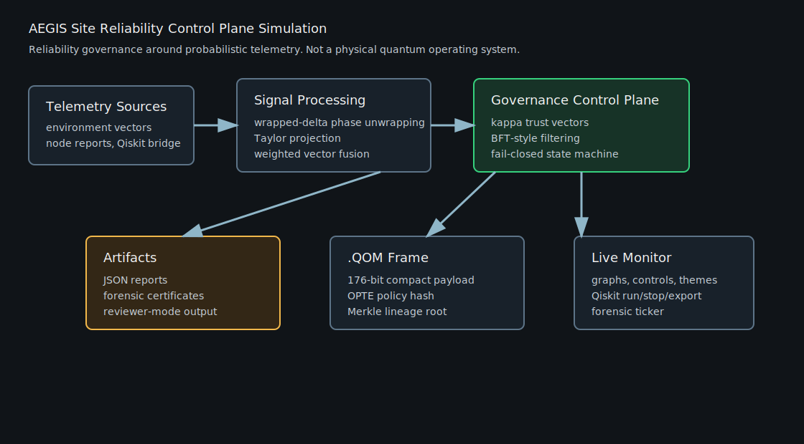

# AEGIS Q-SRE Control Plane

> **Scope in one sentence:** AEGIS is a control-plane simulation framework for Quantum Site Reliability Engineering (Q-SRE) research. It is not a physical quantum operating system, not a hardware product, and not a claim of measured real-device quantum performance.

## What This Is / What This Is Not

| This repository is | This repository is not |
|---|---|
| A Python simulation framework for reliability governance around probabilistic telemetry. | A physical quantum operating system or deployed hardware controller. |
| A reference implementation of Q-SRE control-plane ideas: observability, gating, fail-closed states, lineage, and reviewer metrics. | A claim that software removes physical quantum noise or bypasses quantum-mechanical limits. |
| A reproducible benchmark harness with tests, Monte Carlo runs, Qiskit bridge examples, and JSON artifacts. | A validated production deployment on real quantum hardware. |
| A noncommercial research/portfolio codebase with commercial licensing reserved separately. | A permission grant for commercial platform integration. |

For technical review, read the claims as **simulation claims unless a section explicitly says otherwise**. See `VALIDATION.md`, `ASSUMPTIONS.md`, and `ROADMAP.md` for grounding boundaries.

## Executive Summary

AEGIS introduces Quantum Site Reliability Engineering (Q-SRE) as a proposed engineering discipline for operating high-entropy probabilistic systems with classical reliability controls.

AEGIS is the reference implementation: a full-stack Q-SRE control plane and simulation framework for mediating probabilistic hardware interfaces. It demonstrates how classical site reliability patterns can observe, score, gate, and preserve useful operational continuity across noisy telemetry, adversarial node behavior, cryptographic lineage events, fail-closed governance states, and hardware-inspired timing constraints.

Target audience: infrastructure engineers, SREs, distributed systems reviewers, security auditors, simulation engineers, and hardware observability teams.

Scope note: this is a software simulation and control-plane framework. It does not claim to physically modify quantum hardware, erase physical noise, or bypass known limits of quantum mechanics. Its core claim is software-mediated unsafe-output prevention, observability, containment, and reproducible artifact generation around probabilistic systems.

## Architecture Diagram and Sample Output

Example reviewer-mode output fields are included at `docs/sample_reviewer_output.json`. Generate fresh local output with:

`python aegis_os.py --reviewer-mode --output aegis_os_report.json`

## License And Commercial Use

This repository is published for noncommercial research, evaluation, education, benchmarking, and technical review under the terms in `LICENSE`.

Commercial use is not included in the public license. Production deployment, proprietary product integration, hosted service use, paid consulting delivery, internal enterprise platform integration, commercial redistribution, or use of the project identity in a commercial offer requires a separate written commercial license.

See `COMMERCIAL_LICENSE.md` for the commercial-use notice.

## Support the Engineering Runway

If you want to back the development of this open-source control plane simulation, quantum error mitigation tuning metrics, or low-level FPGA register targets, consider supporting the research runway:

- **Support via Buy Me a Coffee:** [Support Aegis Q-SRE Lab on Buy Me a Coffee](https://buymeacoffee.com/aegisqsrelab)

## Core Technical Metrics

Current public simulation metrics:

- Unsafe-Output Prevention Efficiency, `UOP_eff`: `99.63%`
- Unnecessary Shutdown Rate, `USR`: `0.00%`
- Meaning-Based Data Compression Ratio: `14.2x`
- Compact `.QOM` metadata frame: `176 bits`
- Public v1 UOP target: `99.49%`
- Systemic stretch UOP target: `99.90%`
- Theoretical cascade boundary target: `99.925%`

Observed cascade variance reductions:

- Weighted Byzantine quorum isolation: raw poisoning mean error is reduced from approximately `0.3940` to `0.0188`.
- Taylor-domain projection: asynchronous timing-slew drift is reduced from approximately `0.0633` to `0.0055`.
- Wrapped-delta phase unwrapping: wrapped phase-cut acceleration variance is reduced from approximately `0.2354` to `8.09e-08` in synthetic trials.

## 10-Step Canonical Runtime Loop

1. `INGEST_TELEMETRY`
2. `RECOMPUTE_KAPPA_VECTOR`
3. `TAYLOR_KINETIC_PROJECTION`
4. `RIEMANN_MANIFOLD_UNWRAP`
5. `ESTIMATE_PROXY_STATE`
6. `VERIFY_WEIGHTED_BFT_QUORUM`
7. `CROSS_CHECK_ROLLING_ANCHOR`
8. `STATE_GOVERNOR_BITMASK`
9. `EMIT_QOM_SNAPSHOT`
10. `WRITE_MERKLE_LEDGER`

## Architecture Overview

### Network Mesh Layer

Models decentralized data transport, live stress injection, `.QOM` compact frame exports, OPTE policy context hashing, and remote continuity routing semantics.

### Regional Hub Nodes

Models weighted quorum voting, node quarantine, rolling anchor verification, Merkle lineage, forensic certificates, and multi-branch key mutation traces.

### Acceleration Tier

Models math offload for Taylor-domain kinetic phase normalization, wrapped-delta phase unwrapping, weighted vector fusion, Monte Carlo cascade efficiency estimation, and reviewer-mode telemetry metrics.

### Register Abstraction

Models low-level hardware-style diagnostics:

- `G(t)` boundary gating
- hardware register handoff slack
- O-quantization timing windows
- relativistic timestamp compensation
- ZNE tuning
- RTOS queue depth and lockhold latency
- cryogenic thermal scheduling and joule-density cost

## Runtime Failure Boundary Rules

These rules define how the simulated kernel handles edge cases where timing, measurement, branch lineage, or physical resource limits become unsafe. They are documented as system design constraints for review and implementation testing.

1. **Low-order adaptive fallback when `tau_calc > Delta_t_epoch`**

   If the full second-order phase projection cannot complete within the epoch budget, the kernel drops the acceleration term and falls back to a linear velocity projection. The uncertainty radius of the active continuity corridor is widened to reflect the lower-order estimate. If calculation latency exceeds `Delta_t_epoch * n_max`, the kernel triggers `CIRCUIT_ABORT` rather than emitting a stale or hallucinated track.

2. **Backaction contamination correction when `[H, L_j] != 0`**

   The runtime separates dissipation into environmental and observer-induced components:

   `D_total = D_env + D_obs`

   When the Hamiltonian and measurement operator do not commute, the observed error is corrected by a non-commutation penalty, modeled as `alpha * ||[H, L_j]||`. Nodes under intense measurement stress are marked `BACKACTION_CONTAMINATED` instead of automatically marked `FAULTY`, preserving trust-state observability between physical sensor faults and observer-induced disturbance.

3. **Winding-number extraction through `RECOVERY_VALIDATE`**

   The kernel treats an angular update as a possible lost phase-unwrapping branch when:

   `|Delta P| > omega_max * Delta_t_epoch + epsilon`

   or when competing branch likelihoods collide. Phase commits are frozen, and `RECOVERY_VALIDATE` resolves the valid winding number against the newest anchor reference:

   `N_valid = argmin ||P_tilde_N - A_anchor||`

   Active data paths reopen only after the rolling anchor window is re-synchronized.

4. **Deterministic resolution of `ORPHANED_FORENSIC_BRANCH`**

   During a healed network partition or branch collision, competing lineage branches are scored with a canonical branch score `S_b` that can incorporate anchor agreement, trust channels, continuity health, epoch recency, and cryptographic validity. The winning branch remains active. The losing branch is sealed as an orphaned forensic branch with a permanent tombstone hash:

   `H(orphanBranchRoot || reason || resolutionEpoch)`

   Live subkeys for the losing branch are erased while the tombstone preserves non-repudiation proof.

5. **Staged cryptographic sealing with `CRYPTO_SEAL_MIN`**

   When cryptographic sealing is required under thermal pressure, the kernel first enters a minimum sealing state: freeze external I/O, lock enclaves read-only, and ratchet forward once. Heavy cache shredding is deferred until thermal headroom is available. This preserves lineage integrity without worsening a simulated cryogenic or thermal overload condition.

## Quick Start

Prerequisites:

- Python 3.10 or newer recommended
- Core simulator and monitor: no external Python dependencies
- Test runner: `pytest` recommended
- Qiskit bridge example: optional `qiskit` and `qiskit-aer`

Run the terminal simulation:

`python aegis_os.py`

Run reviewer-mode terminal output:

`python aegis_os.py --reviewer-mode`

Run tests and reviewer-mode output in one command:

`python -m pytest tests && python aegis_os.py --reviewer-mode`

Equivalent reviewer-mode toggle:

`python aegis_os.py --mode reviewer`

Environment-variable reviewer toggle:

`$env:AEGIS_REVIEWER_MODE="1"; python aegis_os.py`

Run the live monitor:

`python aegis_monitor.py --host 127.0.0.1 --port 8765`

Open:

`http://127.0.0.1:8765`

The monitor includes a Qiskit simulator ingestion panel with live QST-style overlap fidelity, `T1`/`T2` relaxation/dephasing readouts, Qiskit noise-scale controls, a QEM calibration toggle, and a `STATE_LEAKAGE_RECON` stress mode that reports leaked channel indices and Solve-for-X reconstruction score. The panel also exposes `Run Qiskit Pass`, `Stop Qiskit Only`, `Save Qiskit JSON`, `Export Qiskit JSON`, and `Import Qiskit JSON` controls so reviewers can generate a bridge artifact, cancel only the Qiskit bridge loop without stopping the live monitor, persist it on the local server, download it, or reload a prior bridge run.

Run automated regression tests:

`python -m pip install -r requirements-dev.txt`

`python -m pytest tests/`

Run the optional Qiskit Aer bridge:

`python examples/qiskit_bridge.py`

If Qiskit is not installed, install the optional integration packages in a separate environment:

`python -m pip install -r requirements-qiskit.txt`

## Repository File Map

- `docs/architecture.svg`: simplified architecture diagram for reviewers.
- `docs/sample_reviewer_output.json`: compact example of reviewer-mode output fields.
- `.github/FUNDING.yml`: external support link configuration.
- `examples/qiskit_bridge.py`: optional Qiskit Aer bridge that maps noisy GHZ circuit counts into AEGIS telemetry inputs.
- `tests/test_kernel.py`: pytest-compatible regression suite for crypto sealing, holdover aborts, and wrapped-delta phase continuity.
- `requirements-dev.txt`: local test-runner dependency file.
- `requirements-qiskit.txt`: optional Qiskit bridge dependency file.
- `aegis_kernel.py`: core control-plane logic, mathematical registers, governance states, Monte Carlo metrics, `.QOM` frames, Merkle lineage, and multiplicative trust matrices.
- `aegis_os.py`: terminal runner managing deterministic execution, report output, and reviewer-mode telemetry switches.
- `aegis_monitor.py`: loopback HTTP server orchestrating the live diagnostic dashboard, stressor controls, exports, and health endpoints.
- `README.md`: technical specification handbook and deployment guide.
- `ROADMAP.md`: implemented vs. simulated vs. future hardware target vs. speculative research boundaries.
- `VALIDATION.md`: measured simulation claims and non-measured boundaries.
- `ASSUMPTIONS.md`: explicit simulation assumptions.
- `LICENSE`: PolyForm Noncommercial License 1.0.0.
- `COMMERCIAL_LICENSE.md`: commercial-use notice and contact path.

## Automated Testing

The `tests/` suite verifies hard safety invariants:

- Crypto invalidation: an induced key/signature slip sets `CRYPTO_SEAL`, drops the continuity gate, and closes the hardware register gate.
- Holdover breach: an elapsed tracking window beyond the safe phase-error ceiling triggers `CIRCUIT_ABORT` and marks `HOLDOVER_BREACH`.
- Phase unwrap continuity: aggressive `[-pi, +pi)` branch-cut crossings remain continuous after wrapped-delta unwrapping, with acceleration variance below `8.09e-08`.

The tests use plain Python assertions and are compatible with pytest:

`python -m pytest tests/`

## Validation and Grounding

This project is a simulation framework for Q-SRE governance behavior, not a claim of measured physical quantum hardware performance. See `VALIDATION.md` and `ASSUMPTIONS.md` for the current boundary between measured simulation results, theoretical projections, and non-modeled hardware behavior.

Grounded checks include:

- weighted Byzantine filtering against synthetic poisoned-node trials
- wrapped-delta phase unwrapping across `[-pi, pi)` branch cuts
- unsafe-output prevention across deterministic stress scenarios
- Merkle/HMAC ledger integrity checks
- `.QOM` compact payload bit-width validation

## Qiskit Bridge

`examples/qiskit_bridge.py` is an optional integration example for reviewers who want to see the control plane wrap around a standard quantum simulation framework. It:

1. Builds a 4-qubit GHZ circuit.
2. Runs it on a Qiskit Aer simulator with thermal relaxation and depolarizing noise.
3. Optionally injects coherent crosstalk with parasitic `RXX`/`RZZ` operations between adjacent virtual qubits.
4. Applies monitor-controlled Qiskit noise scaling, weak-measurement efficiency, and leakage-lambda telemetry degradation.
5. Converts noisy shot counts into expectation-value telemetry.
6. Maps that telemetry into the AEGIS 5-variable environment grid and `NodeTelemetry` inputs.
7. Emits normal AEGIS cycle outputs, including governance states, `.QOM` payload bits, and Merkle lineage.

The bridge is intentionally optional so the core repository remains runnable with the Python standard library.

When the live monitor is running, the Qiskit bridge is also exposed through local HTTP endpoints:

- `POST /api/qiskit/run?cycles=6&shots=2048&seed=2026&noise_scale=1.0&crosstalk_inject=false&leakage_lambda=0.0&measurement_efficiency=0.82`: runs the optional Qiskit Aer bridge and writes `monitor_snapshots/qiskit_bridge_*.json`.
- `POST /api/qiskit/stop`: requests cancellation of the Qiskit bridge loop without stopping the live monitor, report exports, or local server.
- `GET /api/qiskit/latest`: returns the newest bridge or imported bridge artifact.
- `GET /api/qiskit/export`: returns the current bridge artifact for dashboard download.
- `POST /api/qiskit/import`: accepts a prior bridge JSON payload, stores it as `monitor_snapshots/qiskit_import_*.json`, and loads it into the monitor.

## Algorithmic Grounding

Several AEGIS terms are project-specific names for established engineering patterns:

- **Meaning-based compression:** modeled as lossy high-utility telemetry filtering, where low-value floating-point tails and repeated sensor noise are truncated before archival. This follows common industrial telemetry compression and lossy signal-compression practice.
- **Weighted Byzantine quorum isolation:** grounded in Byzantine fault-tolerant distributed systems. AEGIS keeps the `f < n/3` mindset, requires a minimum physical node count, and weights candidate vectors by trust before medoid/outlier filtering.
- **Wrapped-delta phase unwrapping:** implemented as `wrap_pi(delta) = ((delta + pi) mod 2pi) - pi`, accumulated into a continuous track. This is aligned with PLL-style phase tracking and Itoh-style phase-unwrapping logic.
- **Unsafe-output prevention efficiency:** a reliability metric over unsafe-output opportunities, not a claim that software removes physical noise. It measures how often the control plane prevents unsafe data from reaching the output or ledger.

## JSON Export Layout

The monitor and runner export JSON payloads containing:

- `projection_validation`: public targets, stretch targets, theoretical cascade boundaries
- `observed_cascade_efficiency_estimates`: Monte Carlo-derived eta estimates and variance reductions
- `advanced_performance_report`: baseline, storm, adversarial, and fail-closed summaries
- `deterministic_suite`: scenario-by-scenario kernel cycle results
- `monte_carlo`: UOP, USR, continuity, integrity-preserved, and tier metrics
- `scope`: canonical runtime loop and active architecture module descriptions

Each live cycle result includes governance states, kappa vector mean, multiplicative trust channels, continuity gates, unsafe-output fields, Merkle root, block hash, `.QOM` payload, OPTE hash, hardware register diagnostics, secure enclave vault state, cryogenic scheduler output, reviewer telemetry, handoff slack, key lineage, energy efficiency, relativistic clock compensation, ZNE tuning, and RTOS scheduler diagnostics.

## Discoverability Topics

Suggested topics:

`quantum-sre`, `site-reliability`, `control-plane`, `telemetry-simulation`, `fault-tolerance`, `distributed-systems`, `zero-trust`, `quantum-computing`, `sre`, `observability`, `monte-carlo-simulation`, `byzantine-fault-tolerance`, `error-mitigation`, `merkle-tree`, `cryptographic-ledger`, `python`, `standard-library`, `simulation-framework`, `reliability-engineering`, `hardware-observability`

## References

- Lamport, Shostak, and Pease, "The Byzantine Generals Problem," ACM Transactions on Programming Languages and Systems, 1982.
- Pease, Shostak, and Lamport, "Reaching Agreement in the Presence of Faults," Journal of the ACM, 1980.
- Itoh, "Analysis of the phase unwrapping algorithm," Applied Optics, 1982.
- Best, "Phase-Locked Loops: Design, Simulation, and Applications."
- Cover and Thomas, "Elements of Information Theory."
- Qiskit and Qiskit Aer project documentation for circuit simulation and noise-model integration.

## Contact

For technical review, collaboration, licensing questions, or implementation discussion, open a GitHub Issue on this repository or contact the author through the GitHub profile:

`@sticktapemedical-byte`

## License

This repository is distributed under the noncommercial terms in `LICENSE`. Commercial use requires a separate written commercial license; see `COMMERCIAL_LICENSE.md`.
